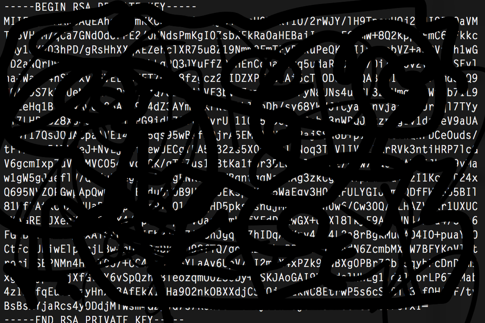

## issue

젠킨스를 설치한 서버가 아닌 외부 서버를 대상으로 스케줄러를 돌리기

<br>

## process

jenkins에 slave node를 등록하려면, jenkins가 돌아가고 있는 서버에서 SSH 키를 만들어 slave node에 인증을 해줘야 한다.

그러므로 Jenkins  페이지에서도 작업을 해야하지만 양쪽 서버에서 다 작업을 해줘야합니다. 

처음이라 많이 헤맸지만, 다시 헤매고 싶지 않아 이렇게 기록을 해둡니다. jenkins야 왜 한번에 안알려주냐!

<br>

### slave node server에 사용자 jenkins 추가

1. slave node로 등록할 서버에 'jenkins'라는 사용자 만들어주기
   스케줄러를 돌릴 때, 일반적으로, 스케줄러 돌릴 용도로 사용자를 만들어 준다고 합니다.

    ```
    $ sudo adduser jenkins
    ```

2. 사용자 jenkins의 권한 권한 수정해주기

    ```shell
    $ vim /etc/sudoers
    ```
    `/etc/sudoers` 들어갑니다. 

    ```shell
    # User privilege specification
    root	ALL=(ALL)	ALL
    jenkins ALL=(ALL)	NOPASSWD: ALL	# 이 줄을 추가해주세요
    ```
    jenkins의 권한을 비밀번호 없이 접근 가능하도록 수정해줍니다.

<br>

<br>

### jenkins가 설치된 server에서 SSH Key 인증

1. jenkins(master) 서버에서 SSH 키 만들기

    실제 jenkins가 돌아가고 있는 서버에 로그인해줍니다. 

    ```shell
    $ ssh-keygen -t rsa
    ```
    여러가지 질문이 나오는데 다 빈칸으로, 엔터를 그냥 계속 눌러주면 됩니다.

    비밀번호를 설정해주면 매번 비밀번호를 입력해야되는 수고로움이 있습니다.

2. slave 서버에 만든 SSH 키 인증하기

    ```shell
    $ ssh-copy-id jenkins@`your slave server ip or domain`
    ...
    The authenticity of host '10.20.3.132 (10.20.3.132)' can't be established.
    ECDSA key fingerprint is 53:c2:32:63:12:a2:8f:29:25:40:fa:0a:b1:d4:8c:f4.
    ...
    Permission denied
    ```
    우리가 이미 slave 서버에 jenkins를 만들었기 때문에 jenkins라는 서버에 인증을 해주는 것입니다.

    마지막에 'Permission denied'라고 떠서 실패한 것 같지만 잘 읽어보면 위에 `fingerprint`가 찍혔다고 메세지가 뜬 것을 확인할 수 있습니다. 제대로 등록된 것입니다.

<br>

<br>

### jenkins에 credentials, ssh private key 등록

1. Jenkins에서, 왼쪽 바의 **Credentials > Systems** 페이지 들어간다.
2. **Global credentials (unrestricted)** 클릭 왼쪽 메뉴바의 `Add Credentials` 클릭
3. 아래와 같이 설정하고 SAVE

| Key         | Value                                                        |
| ----------- | ------------------------------------------------------------ |
| Kind        | **SSH Username with private key**                            |
| Scope       | Global                                                       |
| Username    | 접속할 서버의(slave node로 추가할) 사용자 이름 <br />ex)ubuntu, sunho |
| Private Key | Enter directly 선택 후, ssh 또는 pem 키를 텍스트 복사붙여넣기<br />cat, vim을 통하여 키를 열면 텍스트로 보입니다.(아래 사진 참고) |



<br>

<br>

### slave node 등록

1. 왼쪽 바의** Jenkins 관리 > 노드 관리** 페이지 들어간다
2. **신규 노드** 클릭
3. 노드명 입력하고 `Permanent Agent` 선택 후 OK
4. 아래값 설정하고 SAVE

| Key                   | Value                                                        |
| --------------------- | ------------------------------------------------------------ |
| Name                  | slave node 이름                                              |
| Description           | (선택사항) 설명을 입력해주세요                               |
| \# of  executors      | 1                                                            |
| Remote root directory | credentials 등록할 때 입력한 Username의 기본 폴더<br />credentials 등록한 SSH키 서버에 jenkins라는 사용자를 만드는 것을 추천합니다.<br />ex) /home/jenkins |
| Labels                | 닉네임 정도라고 생각하면 됩니다. item 등록할 때 필요합니다.  |
| Usage                 | Use this node as much as possible                            |
| Launch method         | Launch slave agents via SSH (아래에서 자세히)                |
| Availability          | Keep this agent online as much as possible                   |


#### Launch method 설정
- Host:  domain 또는 ip 주소 입력
- Credentials:  위에서 등록한 것 선택
- Host Key Verification Strategy: Known hosts file Verification Strategy
- Port: _고급_ 버튼을 클릭하면 뜨는데, 기본은 22입니다. **이 포트를 꼭 열어두세요.**

`Node Properties` 는 필요하면 추가하세요.

<br>

<br>

### new item 등록하기

이제 jenkins에 slave node까지 붙였으니, 드디어 제가 원하던 스케줄러 작업만 붙여주면 됩니다.

<br>

#### jenkins에서 새로운 item 만들기

1. **새로운 item** 클릭
2. Enter an item name > **Freestyle project**
  존재하는 Item 중에 복사할 게 있다면 **Copy from**으로 복사할 수 있습니다.
3. 구성 설정하고 SAVE

   - 설명: 협업하는 사람들을 위해 써주면 센스쟁이

   - General
     - **오래된 빌드 삭제** 선택
       - Strategy: Log Rotation
       - 보관할 최대갯수: 1000

     - **빌드 안함** 선택

     - **Restrict where this project can be run** 선택

       - Label Expression: 

         등록한 slave node의 label 이름을 입력하면 됩니다. 자동완성 기능이 있으니 처음 몇자만 입력해주면 됩니다.

   - 소스 코드 관리: None

   - 빌드 유발

     - **Build periodically**
       
       원하는 시간마다 실행할 수 있습니다. [crontab.guru](https://crontab.guru/) 을 통하여 쉽게 원하는 값을 찾을 수 있습니다.

   - 빌드 환경: 건너뜁니다

     - Build
       
       `Add build step` 에서 다양한 옵션을 선택할 수 있는데, 저는 스크립트로 바로 실행할 것이기 때문에 `Execute shell`을 선택했습니다.
       - Execute shell: 
         
         쉘로 스크립트를 실행할 수 있습니다. 
         
         실행하는 위치는 설정한 node의 `/home/'node user name'/workspace/'item_name'`입니다. 

   - 빌드 후 조치: 건너뜁니다.

<br>

#### slave node에서 스케줄러 등록할 작업 만들기

스케줄러 돌릴 코드(작업)은 이미 만들어 두셨겠죠?

이 과정을 마지막에 하는 이유는, 작업을 원하는 임의의 위치에 둘 수도 있지만 jenkins가 돌아가는 위치에 둘 수도 있기 때문에 마지막으로 미뤘습니다.

1. slave 서버의  jenkins로 로그인

2. cd workspace/`jenkins에서 만든 item 이름`에 스케줄러 돌릴 작업 만들기

   굳이 이 아래에 두는 이유는 jenkins에서 어디로 이동할지나 권한에 대한 고민을 덜 수 있기 때문입니다.

<br>

## epilogue

이렇게 알면 간단하지만 험난한 jenkins에 slave node 등록하기 + item 추가하기 까지 해보았습니다.

jenkins가 한번 설정해두면 간단하지만 초기 세팅도 간단하진 않네요.

slave node를 등록하려면 jenkins 페이지뿐만 아니라 서버에서도 작업을 해줘야 합니다.

제 사수께서 직접 해봐야 알고, 언제까지 자기가 해줄 수 없으니 저에게 미션을 주셨는데.. 허허.. 힘들었지만 뿌듯하고 감사함을 느낄 수 있었습니다. 고마워요!

<br>
<br>

> 참고:
>
> [Add linux slave node in the Jenkins](https://mohitgoyal.co/2017/02/14/add-linux-slave-node-in-the-jenkins/)
>
> [How To Install Java with Apt-Get on Ubuntu 16.04](https://www.digitalocean.com/community/tutorials/how-to-install-java-with-apt-get-on-ubuntu-16-04)
>
