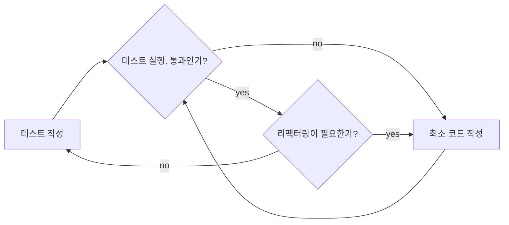

# 파이썬을 이용한 | 클린 코드를 위한 테스트 주도 개발

## TDD 프로세스

### Functional Tests (기능 테스트)

- FT 자체가 애플리케이션 사양이 될 수 있음
- 사용자 스토리(User Story)라고 하는 방식을 따를 경향이 있음
- 특정 기능을 사용자가 어떻게 사용하며 이때 애플리케이션이 어떻게 반응해야 하는지를 확인하는 방식
- 기능 테스트 = 승인(Acceptance) 테스트 = 종단간(End-to-End) 테스트
- 전체 애플리케이션이 어떻게 동작하는지를 외부 사용자 관점에서 확인하는 테스트
- Blackbox 테스트라는 용어를 사용하는 경우도 있음. 시스템 내부에 대해선 전혀 알지 못하기 때문.
- 사람이 이해할 수 있는 스토리를 가지고 있어야 한다. 이것을 분명하게 정의하기 위해 테스트 코드에 주석을 기록한다.

**사용자 스토리(User story)**
사용자 관점에서 어떻게 애플리케이션이 동작해야 하는지 기술할 것이다. 기능 테스트 구조화를 위해 사용한다.

**예측된 실패(Expected failure)**
의도적으로 구현한 실패한 테스트를 의미한다.

책을 따라하다 막힐 때는 한걸음 물러나서 해당 부분에서 성취하고자 하는 것이 무엇인지 생각해보자. 그리고 어떤 파일을 편집하고 있는지, 사용자가 무엇을 하기 원하는지, 무엇을 왜 테스트하는 것인지 **생각**해보도록 한다. 아무 생각 없이 과정을 따라 하고 단순히 코드를 붙여 넣기 하는 것보다, 읽던 것을 멈추고 생각하는 과정을 통해서 TDD에 대해 배울 수 있을 것이다.

### Unit Tests (단위 테스트)

기능 테스트는 사용자 관점에서 애플리케이션 외부를 테스트하는 것이고,
단위 테스트는 프로그래머 관점에서 그 내부를 테스트한다는 것이다.

#### 작업 순서

이 책에서 다루는 TDD 접근법은 양쪽 테스트를 모두 적용한다.

1. 기능 테스트를 작성해서 사용자 관점의 새로운 기능성을 정의하는 것부터 시작한다.
2. 기능 테스트가 실패하고 나면 어떻게 코드를 작성해야 테스트를 통과할지(또는 적어도 현재 문제를 해결할 수 있는 방법)를 생각해보도록 한다.
   이 시점에서는 하나 이상의 단위 테스트를 이용해서 어떻게 코드가 동작해야 하는지 정의한다(기본적으로 모든 코드가 적어도 하나 이상의 단위 테스트에 의해 테스트 돼야 한다).
3. 단위 테스트가 실패하고 나면 단위 테스트를 통과할 수 있을 정도의 최소한의 코드만 작성한다. 
   기능 테스트가 완전해질 때까지 과정 2와 3을 반복해야 할 수도 있다.
4. 기능 테스트를 재실행해서 통과하는지 또는 제대로 동작하는지 확인한다. 이 과정에서 새로운 단위 테스트를 작성해야 할 수도 있다.

이 과정을 보면, <u>기능 테스트는 상위 레벨의 개발을 주도하고 단위 테스트는 하위 레벨을 주도한다</u>는 것을 알 수 있다.

과정이 너무 많다고 느낄 수도 있다. 하지만 <u>기능 테스트와 단위 테스트가 전혀 다른 목적을 가지고 있어</u>서 서로 다른 결과를 초래할 수 있기 때문에 꼭 필요한 과정이라 할 수 있다.

기능 테스트는 제대로 된 기능을 갖춘 애플리케이션을 구축하도록 도우며, 그 기능이 망가지지 않도록 보장해준다. 반면, 단위 테스트는 깔끔하고 버그 없는 코드를 작성하도록 돕는다.

#### Traceback 읽기

Traceback을 빠르게 읽어서 **필요한 단서를 찾는 방법**을 금방 배울 수 있다.

1. "에러" 찾기
   이 부분이 핵심인데, 어떤 때에는 이 부분만 읽고 바로 문제를 파악할 수 있다.
2. "어떤 테스트가 실패하고 있는가?"
   이 실패가 예측된 실패인지를 확인해야 한다.
3. 마지막으로 실패를 발생시키는 "테스트 코드" 찾기

- 단위 테스트는 기능 테스트에 의해 파생되며 더 실제 코드에 가깝다. 

단위 테스트를 작성할 때는 프로그래머처럼 생각해야 한다.

### 단위 테스트 - 코드 주기

1. 터미널에서 단위 테스트 실행
2. 편집기에서 최소 코드 수정
3. 반복

- 코드 품질을 높이고 싶다면 코드 변경을 최소화해야 한다.
  또한 이렇게 최소화한 코드는 하나하나 테스트에 의해 검증돼야 한다.
  따라서 아무리 자신 있는 부분이라도 작은 단위로 나누어 코드를 변경하도록 한다.

TDD가 훌륭한 이유 중 하나가 다음에 무엇을 해야 할지 잊어버릴 걱정이 없다는 것이다. 테스트를 다시 실행하기만 하면 다음 작업이 무엇인지 가르쳐준다.

- 기능 테스트를 많이 수정했다면 커밋을 하는 것이 좋은 습관이다. 
  필자도 처음에는 이런 습관이 없어서 나중에 여러 변경 작업이 섞이고 나서야 후회했었다. 커밋 시에는 가능한 작은 단위로 하는 것이 좋다.

- 단위 테스트 시의 일반적인 규칙 중 하나는 "상수는 테스트하지 마라"
  HTML을 문자열로 테스트하는 것은 상수 테스트와 같다.

- 단위 테스트는 로직, 흐름 제어, 설정 등을 테스트하기 위한 것이다.
  정확히 어떤 글자들이 HTML 문자열에 배열돼 있는지 체크하는 어설션은 아무 의미가 없다.

### Refactoring(리팩터링)

e.g. 뷰 함수가 이전과 같은 HTML을 반환하도록 하는 것이지만, 다른 프로세스를 적용하는 것

- 리팩터링이란 **기능(결과물)은 바꾸지 않고** 코드 자체를 개선하는 작업을 일컫는다.

- 리팩터링 시에는 앱 코드와 테스트 코드를 한 번에 수정하는 것이 아니라 하나씩 수정해야 한다

리팩터링 시에는 몇 가지 처리를 수정하기 위해 단계를 건너뛰는 경향이 있다. 하지만 자신이 무엇을 수정했는지 모르게 되고 결국 아무것도 동작하지 않게 된다.

리팩터링 후에는 커밋을 해주는 것이 좋다.

#### TDD 프로세스 흐름도 

1. 테스트를 작성하고 실행해서 그것이 실패하는 것을 확인한다.
2. 그리고 문제를 해결하기 위해 최소 코드를 작성한다. 
3. 테스트를 통과할 때까지 이 과정을 반복한다. 
4. 필요에 따라선 코드를 리팩터링한다. 
5. 리팩터링 후에는 다시 테스트 과정을 반복해야 한다.

기능 테스트와 단위 테스트 둘 다 해야 할 때는 기능 테스트를 상위 테스트 관점으로 생각하면 된다.
기능 테스트의 '최소 코드 작성' 부분이 단위 테스트를 이용하는 작은 TDD 주기가 되는 것이다.

**Double-Loop TDD(이중 반복 TDD)**

기능 테스트는 애플리케이션이 동작하는지 아닌지를 판단하기 위한 궁극의 수단이다.
반면, 단위 테스트는 이 판단을 돕기 위한 툴이라 할 수 있다.

- 테스트 분할 작업이 필요하다면, 작업 목록에 메모해두자
  - 작업 목록을 하나씩 지워나가는 것은, 테스트가 성공하는 것만큼의 성취감을 준다.
- 각 테스트는 하나의 기능만 테스트해야 한다
- 테스트에 많은 어설션이 있는 경우, 앞에 있는 어설션이 실패하면 뒤에 있는 어설션 상태를 파악할 수 없다.

- 기능 테스트가 하나의 앱에 종속되지 않고 여러 앱에 적용될 수 있다.
  TF는 사용자 관점의 테스트로, 사용자는 개발자가 어떻게 앱을 나누어서 작업하는지 신경 쓰지 않는다.
  그래서 기능 테스트를 앱에 추가하지 않고 관리한다.